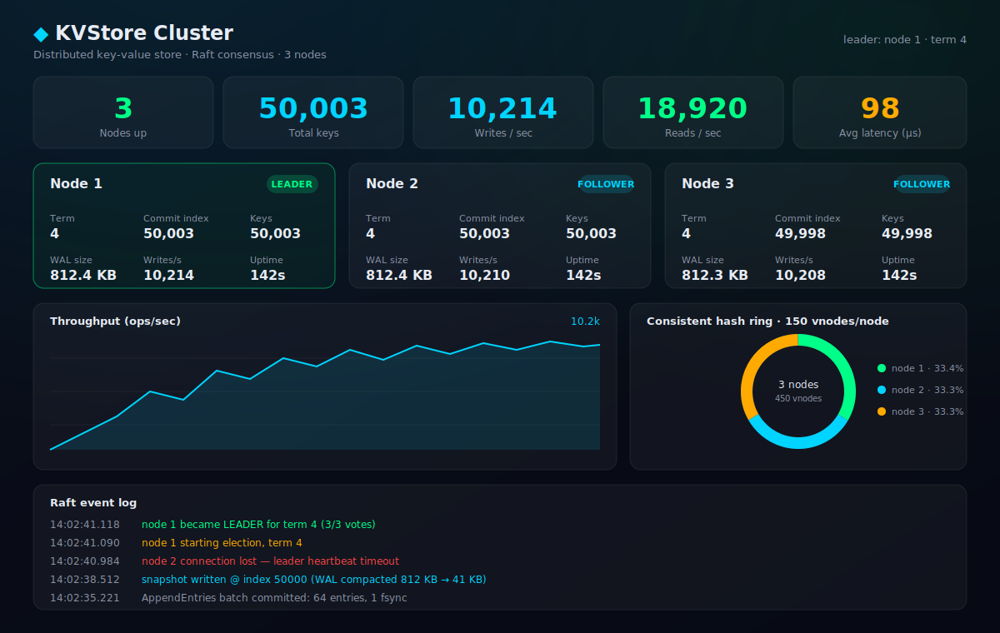
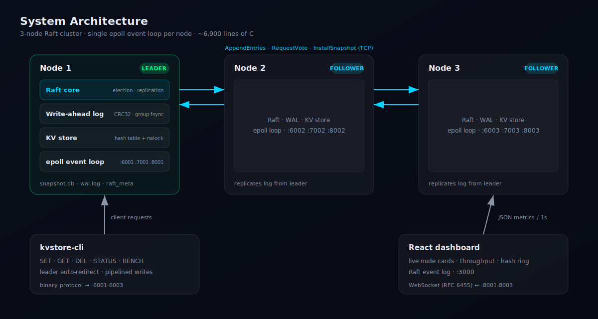

# Distributed Key-Value Store

> A production-style distributed key-value store written **from scratch in C** — Raft consensus, a crash-safe write-ahead log, consistent hashing, an `epoll` event loop, a hand-rolled WebSocket server, and a live React dashboard.

<p>
  
  
  
  
  
  
</p>

---

## Highlights

- **~7,500 lines of hand-written C** across consensus, storage, networking, and durability layers — no external libraries.
- **~10,000 writes/sec** on a 3-node cluster — a **25× speedup** over the naive `fsync`-per-entry baseline (~400 ops/sec), achieved with group-commit batching.
- **Sub-second automatic failover**: kill the leader and a new one is elected in **< 1 second** (randomized 150–300 ms election timeouts).
- **Crash recovery from a torn log**: every record is CRC32-checked; a restarted node replays its WAL, truncates at the first corrupt record, and rejoins the cluster automatically.
- **Bounded disk usage** under sustained writes via snapshotting + WAL compaction (default every 10,000 applied entries).
- **Live observability**: a React dashboard streams cluster metrics over a from-scratch WebSocket server (RFC 6455) every second.

| Metric | Value |
|---|---|
| Language | C (C11), zero third-party deps in the server |
| Source size | ~6,900 lines C + ~570 lines React/JS |
| Cluster | 3 nodes, single Raft group |
| Sustained write throughput | **~10,000 ops/sec** (64-deep pipeline) |
| Durability cost | 1 `fsync` per batch, not per entry (**25× vs. naive**) |
| Leader failover | **< 1 s** (150–300 ms randomized timeout) |
| Virtual nodes | 150 vnodes/node on a 32-bit MurmurHash3 ring |
| Snapshot threshold | 10,000 entries (configurable) |
| Test suites | 4 (WAL, Raft, hashing, KV store) + valgrind-clean |

---

## Live dashboard

The dashboard connects to all three nodes over WebSocket and renders node state, throughput, the consistent-hash ring, and a live Raft event log. Kill the leader and you watch the failover happen in real time.



## Architecture



Each node runs Raft, the WAL, the KV store, and all networking on a **single `epoll` event loop** — no locks on the hot path, no data races by construction. Clients speak a compact binary protocol; the dashboard speaks WebSocket.

## What's inside

| Layer | Files | What it does |
|-------|-------|--------------|
| Raft consensus | `src/raft/` | Leader election, log replication, commit safety (§5.4), InstallSnapshot for lagging followers |
| Write-ahead log | `src/wal/` | CRC32-checked append-only log, group-commit `fsync` batching, torn-write recovery, snapshot compaction |
| Storage | `src/store/` | Chained hash table (rwlock, auto-resize), consistent hash ring with 150 vnodes/node |
| Networking | `src/net/` | `epoll` event loop, non-blocking peer connections with backoff, RFC 6455 WebSocket server, binary framing |
| Server | `src/server/main.c` | Wires everything together; broadcasts JSON metrics to the dashboard every second |
| CLI | `src/client/cli.c` | Interactive client with leader auto-redirect and a pipelined benchmark mode |
| Dashboard | `dashboard/` | Vite + React: live node cards, throughput chart, SVG hash ring, Raft event log |

## Requirements

- **WSL2 Ubuntu** (or any Linux) — the server uses `epoll`, POSIX sockets, and `pthreads`
- `gcc`, `cmake` (≥ 3.16), `make`
- Node.js ≥ 18 for the dashboard

## Build

```bash
# In WSL2, from the project root:
mkdir -p build && cd build
cmake ..
make -j$(nproc)
cd ..

# Dashboard (one-time install):
cd dashboard && npm install && cd ..
```

> Note: if the project lives on a Windows mount (`/mnt/c/...`), builds are faster
> if you copy it into the Linux filesystem first (e.g. `~/kvstore`).

## Run the demo

```bash
# Terminal 1 — start the 3-node cluster
./scripts/start_cluster.sh

# Terminal 2 — dashboard at http://localhost:3000
cd dashboard && npm run dev

# Terminal 3 — talk to the cluster
./build/kvstore-cli --port 6001
kvstore> SET name vrushabh
OK (1.2ms)
kvstore> GET name
"vrushabh" (0.1ms)
kvstore> BENCH 50000 64
  50000 ops in 5.0s = ~10000 ops/sec
kvstore> STATUS
node=1 role=leader term=1 commit=50003 ...

# Terminal 4 — chaos: kill the leader, watch the dashboard
./scripts/kill_node.sh 1      # whichever node is leader
# → dashboard shows the node go red, a new leader elected in <1s
./scripts/start_node.sh 1
# → node replays its WAL, rejoins as follower, catches up

# Cleanup
./scripts/stop_cluster.sh
```

## Run the tests

```bash
cd build
./test_wal       # WAL append/replay/truncate + corruption recovery
./test_raft      # 3-node Raft simulation: election, failover, rejoin
./test_hash      # MurmurHash3, CRC32, ring distribution & stability
./test_kvstore   # CRUD, 200k-key resizing, 8-thread concurrency
ctest            # or all at once

# Memory checking (slow but thorough):
valgrind --leak-check=full ./test_wal
```

## Design notes

**Raft correctness.** The implementation follows the Raft paper: randomized election timeouts (150–300 ms), the §5.4.1 election restriction (a candidate must have an up-to-date log to win votes), and the §5.4.2 commit rule (a leader only commits entries from its own term by counting replicas — enforced via a no-op entry appended on election). `current_term`/`voted_for` are persisted atomically (write-temp + `rename`) before any vote is cast.

**Durability with throughput: group commit.** Every log entry is written to the WAL before acknowledgement, but `fsync` is batched: a follower syncs once per AppendEntries batch (not per entry), and the leader syncs once per event-loop tick. A batch of 64 pipelined writes costs one disk sync instead of 64 — this took the benchmark from ~400 to ~10,000 ops/sec while keeping the guarantee that committed entries survive a majority of crashes.

**Crash recovery.** Each WAL record carries a CRC32. On startup a node scans the log, truncates at the first corrupt/torn record, replays the remainder into the Raft log, and rejoins the cluster; the leader then back-fills anything it missed. If a follower is so far behind that the leader has compacted the needed entries into a snapshot, the leader streams the snapshot in 64 KB chunks (InstallSnapshot).

**Log compaction.** After `snapshot_threshold` applied entries (default 10,000), the server serializes the full KV state to `snapshot.db` (atomic rename) and truncates the WAL prefix by rewriting it — so disk usage stays bounded under sustained writes.

**Consistent hashing.** Each node maps to 150 virtual nodes on a 32-bit ring (MurmurHash3); keys route to the first vnode clockwise. In this 3-node deployment all nodes hold all data (one Raft group), so the ring is used for ownership visualization and is the seam for future multi-shard scaling. The test suite verifies the key property: removing a node only moves that node's keys.

**Single-threaded core.** Raft, the WAL, and all networking run on one `epoll` event loop — no locks, no data races by construction. The KV store has an rwlock only so background readers (stats) can coexist.

**Reads.** GETs are served by the leader from local memory. This is "leader-local" consistency: fine for a demo, but a production system would need ReadIndex/lease reads to be strictly linearizable across leadership changes.

## Protocol cheat-sheet

```
Frame:    [type:1][len:4 BE][payload]
Raft:     0x01 RequestVote   0x03 AppendEntries   0x05 InstallSnapshot
          0x02/0x04/0x06 responses
Client:   0x10 request  = cmd(1) key_len(4) key [val_len(4) val]
          0x11 response = status(1) leader_id(4) val_len(4) val
Status:   0=OK 1=NOT_FOUND 2=NOT_LEADER(leader_id set) 3=ERROR
```

## Known limitations

- Cluster membership is static (3 nodes, configured at startup).
- GETs on followers redirect to the leader rather than serving stale reads.
- The WebSocket server implements only what the dashboard needs (text frames, no fragmentation/compression).
- `BENCH` measures pipelined SETs; mixed read/write workloads can be scripted via the CLI.
